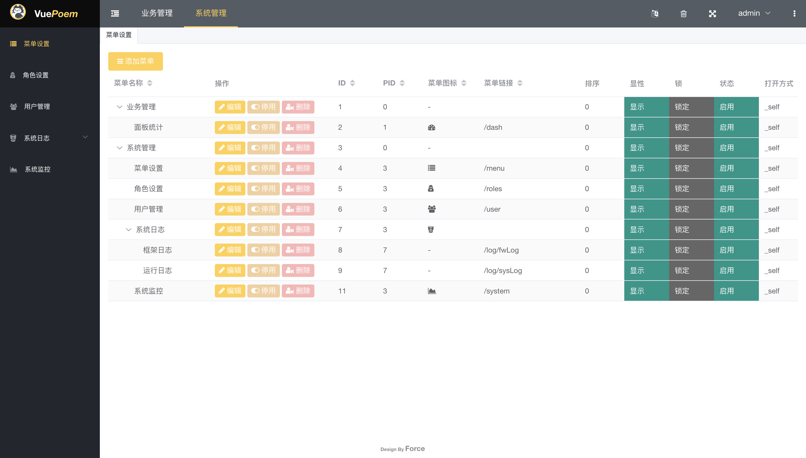

# vuePoem
ENGLISH | [中文](./README_CN.MD)

> A lightweight, open source background rapid development scaffolding

## Project Profile
- vuePoem is a lightweight, open source background rapid development scaffolding
- Combined development based on VUE2 + PHPPOEM framework
- If you are familiar with both VUE and PHP frameworks, you can use this scaffolding to develop your project in the shortest possible time

## Project features
- vue + phppoem separation
- Command-line tools (one-click development mode, one-click packaged deployment mode)
- Development is hands-on, close to zero learning cost
- System ownership
  - Role, menu, user base permission model,
  - Log and system monitoring
  - Customize themes
  - Multi-language support

## Project Environment (similar to this version is recommended)
- PHP 7.4 +
- Node v14.20.0 (NPM v6.14.17) 
- Mysql5.7

## Development of the document
[VuePoem Doc](https://vuepoem.easybhu.cn/doc/en/)

## Open source license
[MIT](LICENSE)

## Author
[Force](https://www.easybhu.cn)

## Preview

