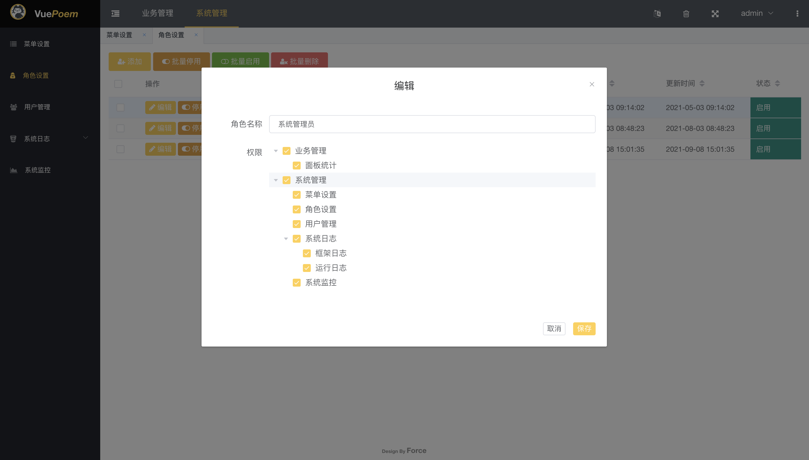
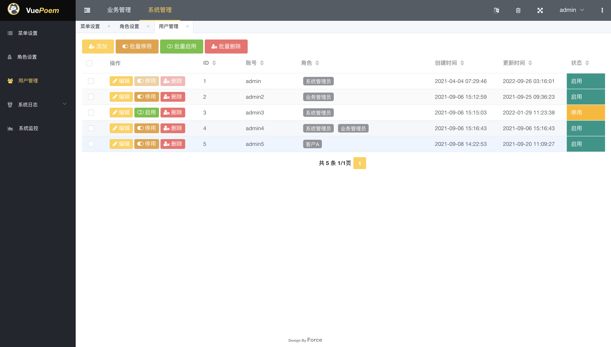

# vuePoem
[ENGLISH](./README.MD) | 中文

> 一款轻量级，开源后台快速开发脚手架

## 项目简介
- vuePoem是一款轻量级，开源后台快速开发脚手架
- 基于vue3 + phppoem框架组合开发
- 如果您同时熟悉vue和php，可以以最短时间利用本脚手架开发项目

## 项目特性
- vue + php前后端分离
- 命令行工具（一键启动开发模式、一键打包部署模式）
- 开发即上手，接近0学习成本
- 系统拥有
  - 角色、菜单、用户基础权限模型
  - 框架集成日志、系统监控
  - 自定义主题
  - i18n支持
  - 封装中间件

## 项目环境（推荐该版本相近版本）
- PHP 7.4+
- Node v16
- Mysql5.7

## 开发运行
- Windows
`cd server/public && php -S 127.0.0.1:8899 index.php`  
`cd vue/ && npm run dev`
  
- MacOS/Linux  
`./vuePoem dev`
  
- Docker  
`cd vue / && npm run build`  
`cd docker/ && docker-compose up`  
或  
`./vuePoem docker`

## 开发文档
[访问文档](https://vuepoem.easybhu.cn/doc/)

## 开源许可
[MIT](LICENSE)

## 作者
[Force](https://www.easybhu.cn)

## 预览

